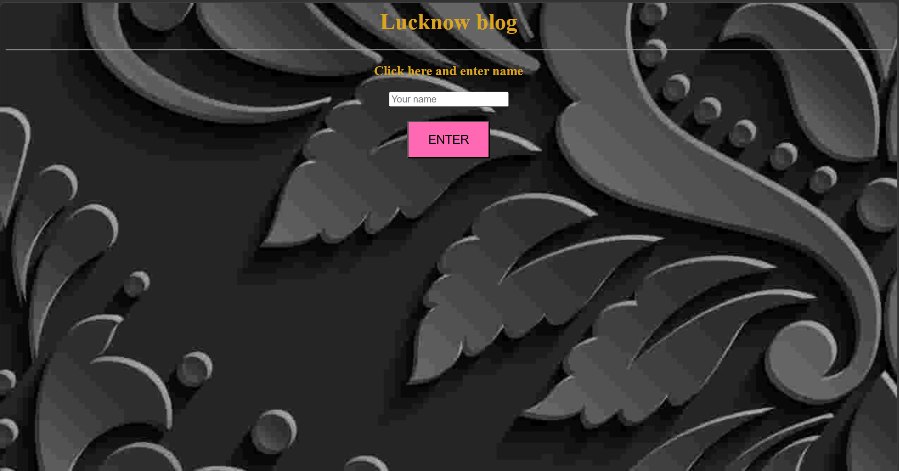
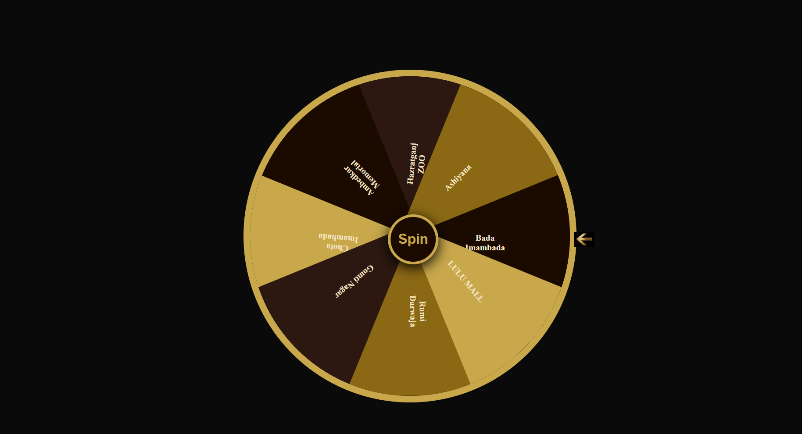
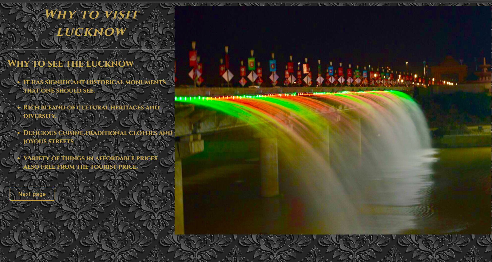
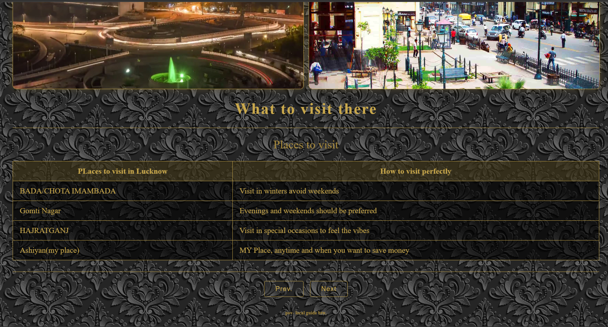
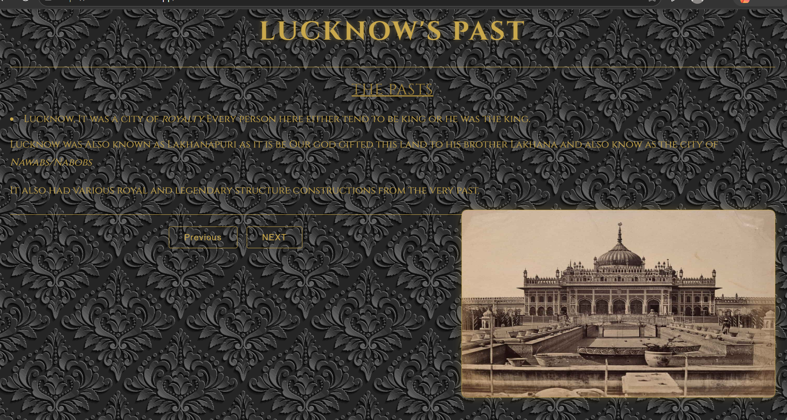

## Nawabi-site

## Site for Lucknow 

I made this site for representation of my city of Nawabs and represented its past, why to visit and what to visit

I told things about my city,Its history and some cool tips to visit

I made it in a pov of local guide and a tourist helper

I hope you liked my advertisement towards my city

I also added some fun things like spinner and welcome page where you enter your name.

## Theme

I gave a golden black and other color like this theme. I centered black and gold for showing royality as our city is used to it.

I kept the same theme in the spinner wheel as well as the profile.

I mostly used damask background as it is cool and syncing well with the theme.

## My tech stack

HTML

CSS

LIL BIT OF JS

## GOALS

I aim to improve this website more by the next year.

I think of adding some svgs stuff more content and fun game etc. in this website.

## MOTIVATION

I was out of website idea so i got a random urge to create my city website and i was also out of time so it was easy sso i created.

## HOW TO FEEL THE SITE

JUST BROWSE THROUGHT IT AND FIND FEATURE THAT I MENTIONED AND YOU CAN ALSO RUN IT LOCALLY BY DOWNLOADING ALL THE FILES IN A FOLDER AND THEN OPENING INDEX.HTML.

##SOME THINGS TO NOTE-

I Did not used a lot of ai but still used it for js randomisation in the spin wheel and css syntax error also used in 1 to 2 place i dont remember.

It is the first version can be buggy.

## MY GALLERY-

